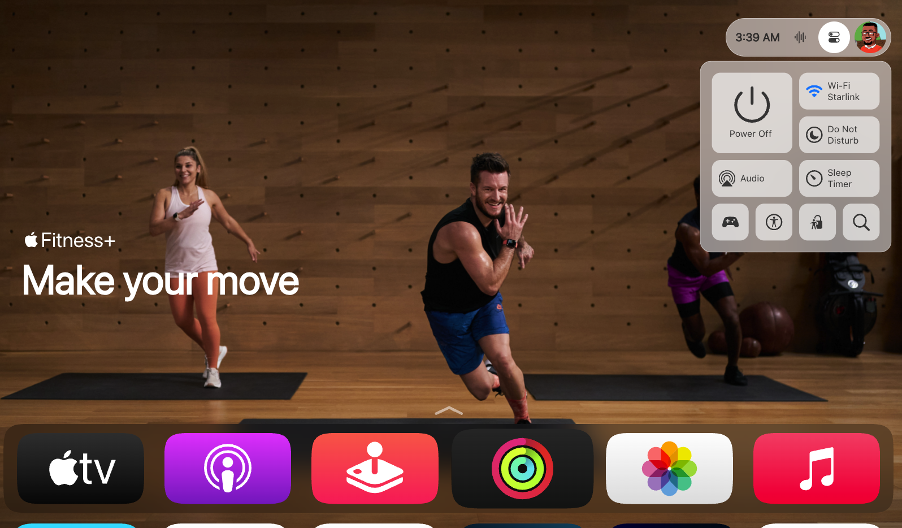

# Apple tvOS® Remake with Next.js and Tailwind CSS 🎉



Welcome to the **tvOS Remake** project! This project is built using [Next.js](https://nextjs.org) and styled with [Tailwind CSS](https://tailwindcss.com). 🚀

## Getting Started 🏁

First, clone the repository and install the dependencies:

```bash
git clone https://github.com/yourusername/tvOS-remake.git
cd tvOS-remake
npm install
# or
yarn install
# or
pnpm install
# or
bun install
```

Then, run the development server:

```bash
npm run dev
# or
yarn dev
# or
pnpm dev
# or
bun dev
```

Open [http://localhost:3000](http://localhost:3000) with your browser to see the result. 🌐

You can start editing the page by modifying `app/page.tsx`. The page auto-updates as you edit the file. ✨

## Project Overview 📺

This project aims to recreate the Apple tvOS interface using modern web technologies. We leverage the power of Next.js for server-side rendering and Tailwind CSS for utility-first styling. 

### Features ✨

- **Next.js**: Fast and optimized React framework.
- **Tailwind CSS**: Highly customizable, low-level CSS framework.
- **Responsive Design**: Works on all screen sizes.
- **Dynamic Content**: Easily manage and update content.

## Learn More 📚

To learn more about the technologies used in this project, check out the following resources:

- [Next.js Documentation](https://nextjs.org/docs) - Learn about Next.js features and API.
- [Tailwind CSS Documentation](https://tailwindcss.com/docs) - Learn how to style your application with Tailwind CSS.
- [Learn Next.js](https://nextjs.org/learn) - An interactive Next.js tutorial.

